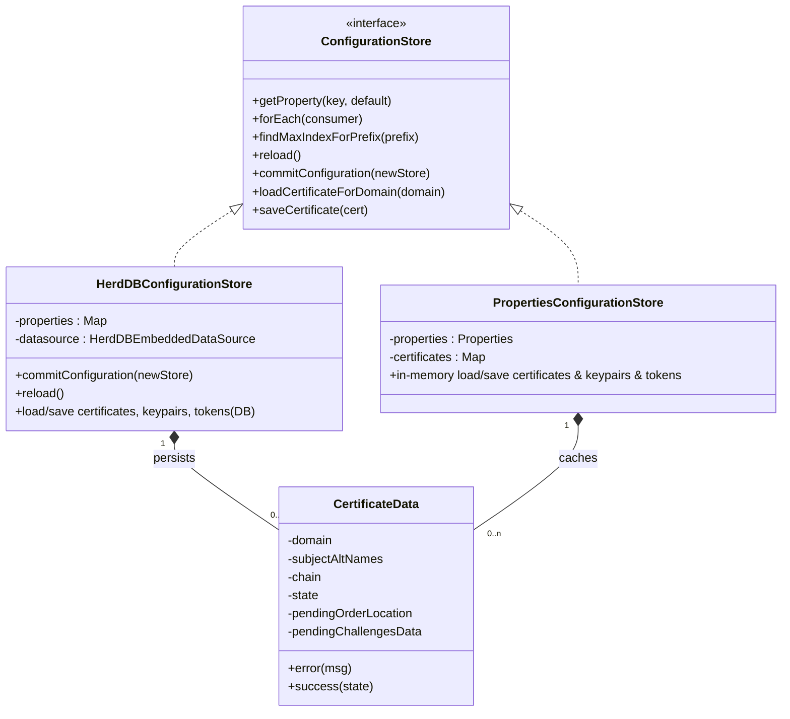
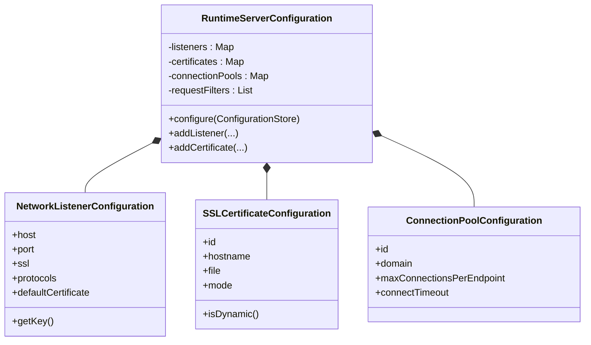
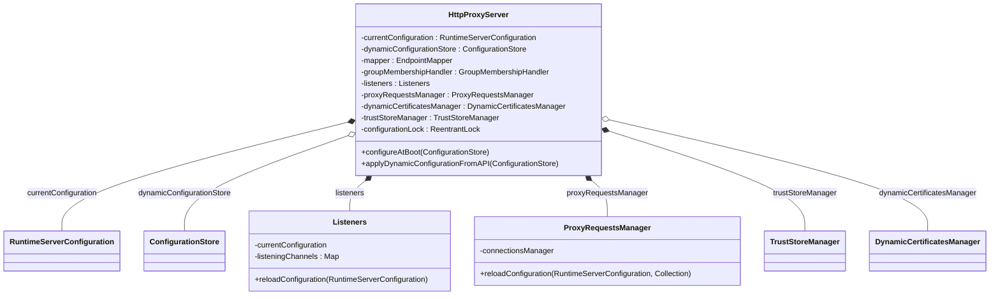
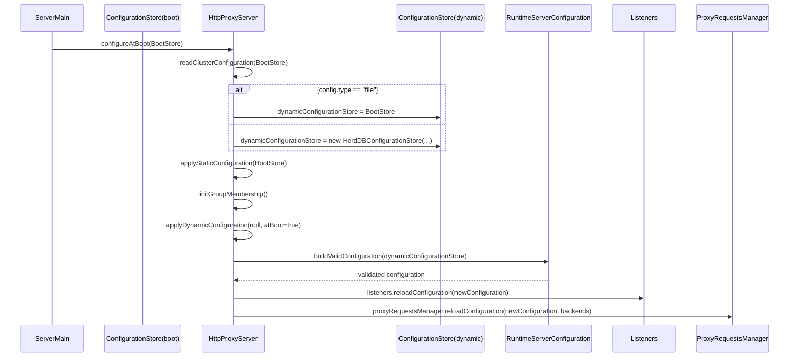
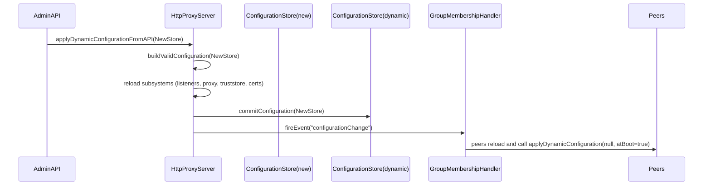
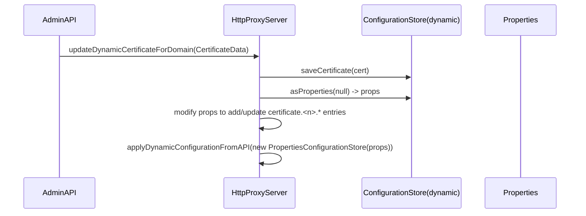
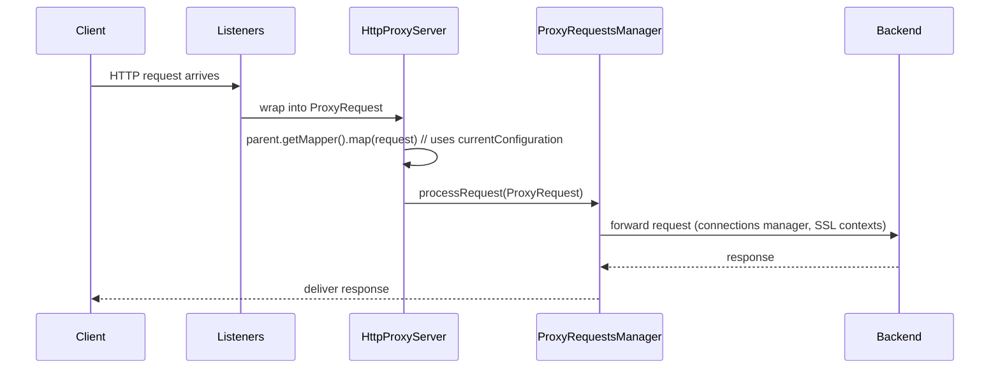

# Configuration Architecture

This document collects concise diagrams and explanations about Carapace configuration storage, runtime configuration model, server composition, and the main interactions (boot, dynamic update, certificate update, request flow).

TL;DR: Static (boot) configuration is read by `ServerMain` -> `HttpProxyServer.configureAtBoot(...)`. Dynamic configuration is stored either in-memory (file properties) or in HerdDB (`HerdDBConfigurationStore`) and is applied via `HttpProxyServer.applyDynamicConfiguration(...)` after validation by `RuntimeServerConfiguration.configure(...)`.

---

## 1. Configuration storage model (compact class diagram)



Caption: `ConfigurationStore` is the abstraction used across the server. `HerdDBConfigurationStore` implements persistence, schema management and commit semantics. `PropertiesConfigurationStore` is a memory-backed store used by file-based dynamic configs or transient payloads. `CertificateData` models ACME certificates and is persisted by the store implementations.

---

## 2. Runtime configuration model (compact class diagram)



Caption: `RuntimeServerConfiguration.configure(ConfigurationStore)` parses and validates dynamic properties into the runtime model. Validation failures are raised as `ConfigurationNotValidException` and prevent applying invalid state.

---

## 3. Server composition (compact class diagram)



Caption: `HttpProxyServer` holds the authoritative `currentConfiguration` object and coordinates subsystem reloads. `configurationLock` serializes local concurrent config applies. In cluster mode, changes are persisted then propagated via group events.

---

## 4. Interaction sequences

### 4.1 Boot-time configuration load



Caption: Boot first applies static keys, chooses the dynamic store, then validates & applies the dynamic configuration. HerdDB initialization may create tables and load properties.

---

### 4.2 Dynamic configuration update (API -> commit -> cluster)



Caption: After validation the server commits the new properties and fires a group event; peers reload from the dynamic store and re-apply the configuration.

---

### 4.3 Certificate update flow (compact)



Caption: Certificate update writes structured certificate data to the DB and also ensures properties contain the `certificate.<n>.*` metadata so that `RuntimeServerConfiguration` parsing recognizes the certificate.

---

### 4.4 Request forwarding path (runtime usage of state)



Caption: Runtime operations depend on the current configuration state: listeners, mapper, connection pools and truststore are consulted during request processing.

---

## 5. Complexity summary & recommendations (short)

Key complexity points
- Dual representation: configuration properties (key/value) + structured DB objects (certs/keypairs) create duplicated state and synchronization burden.
- No explicit config versioning/CAS in the commit path; cluster commits are eventual and may race.
- Validation occurs before commit but peers reload asynchronously; rollout coordination is limited.

Recommendations (high level)
- Adopt a versioned canonical dynamic configuration (JSON) in DB plus separate tables for binary objects (certs/keypairs).
- Use optimistic locking / CAS (config version) on commits to prevent accidental overwrites.
- Separate validation from commit; add a "dry-run" validation API that produces the diffs and required subsystem actions.
- Implement per-subsystem reconcilers to compute minimal changes and perform graceful swaps.
- Consolidate certificate metadata references in the canonical config, keep `CertificateData` as binary/state in its table.
- Add audit metadata for config commits (who/when/version) and expose via admin API.

---

## 6. How to preview / render diagrams locally

Options:
- Use the online editor: https://mermaid.live/ (paste a mermaid fenced block and render)
- Use VS Code with a Mermaid preview extension
- Install Mermaid CLI (Node) and render file snippets:

```powershell
npm i -g @mermaid-js/mermaid-cli
mmdc -i docs/configuration-architecture.mmd -o docs/configuration-architecture.svg
```

Note: the repo Markdown files embed Mermaid blocks; your Markdown renderer must support Mermaid to preview inline.

---

See also
- `carapace-server/src/main/java/org/carapaceproxy/core/HttpProxyServer.java`
- `carapace-server/src/main/java/org/carapaceproxy/core/RuntimeServerConfiguration.java`
- `carapace-server/src/main/java/org/carapaceproxy/configstore/HerdDBConfigurationStore.java`


