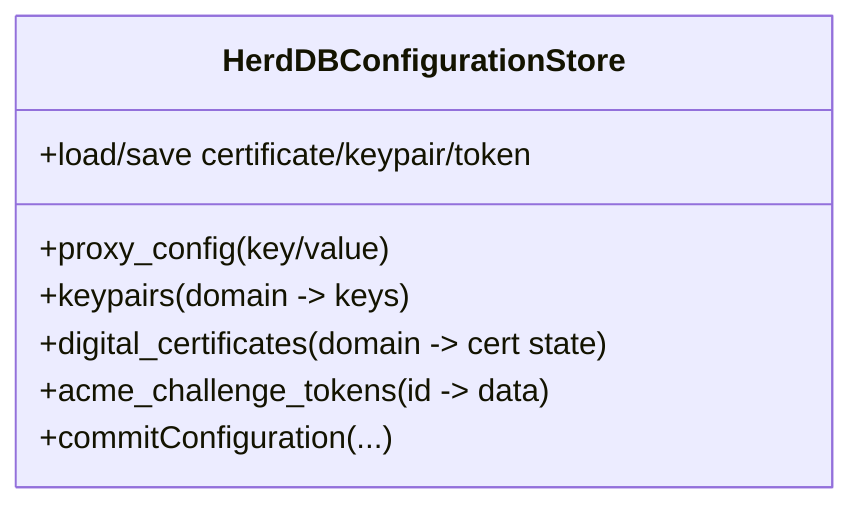

# HerdDB Configuration Store SQL Schema

This document tracks the SQL structure currently used by the Carapace HerdDB-backed configuration store.

Primary source:
- `carapace-server/src/main/java/org/carapaceproxy/configstore/HerdDBConfigurationStore.java`

## Tables

### `proxy_config`

```sql
CREATE TABLE proxy_config (
  pname string primary key,
  pvalue string
)
```

Purpose:
- Stores dynamic configuration properties as key/value pairs.

Primary key:
- `pname`

---

### `keypairs`

```sql
CREATE TABLE keypairs (
  domain string primary key,
  privateKey string,
  publicKey string
)
```

Purpose:
- Stores ACME user keypair and per-domain keypairs.

Primary key:
- `domain`

---

### `digital_certificates`

```sql
CREATE TABLE digital_certificates (
  domain string primary key,
  subjectAltNames string,
  chain string,
  state string,
  pendingOrder string,
  pendingChallenges string,
  attemptCount int,
  message string
)
```

Purpose:
- Stores dynamic certificate lifecycle state and material metadata.

Primary key:
- `domain`

---

### `acme_challenge_tokens`

```sql
CREATE TABLE acme_challenge_tokens (
  id string primary key,
  data string
)
```

Purpose:
- Stores HTTP-01 ACME challenge tokens/authorization payloads.

Primary key:
- `id`

## Indexing

- No secondary indexes are explicitly created by the current implementation.
- Access patterns rely on primary-key lookups and full scan for `proxy_config` load.

## Initialization behavior

- On store startup/reload, the implementation attempts `CREATE TABLE ...` for all tables.
- If a table already exists, the resulting SQL exception is caught and ignored (debug-logged).

## Quick visual: HerdDB responsibilities



For the full configuration architecture and sequence diagrams see `docs/configuration-architecture.md`.

