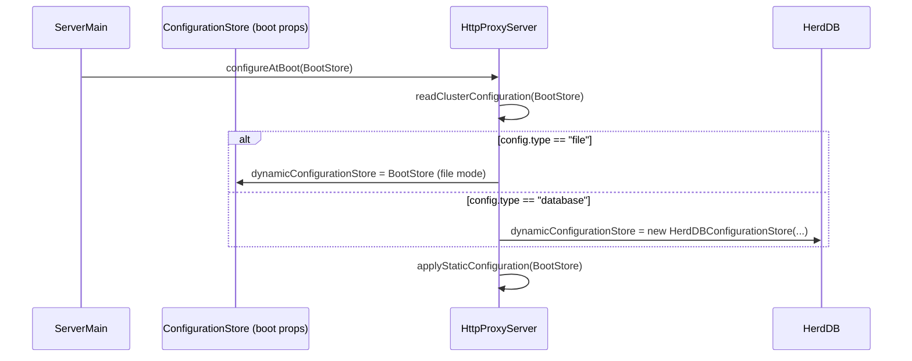

# Carapace Static Configuration Reference

This document tracks properties that are configured at boot time and generally require a full server restart to take effect.

Primary code sources:
- `carapace-server/src/main/java/org/carapaceproxy/core/HttpProxyServer.java`
- `carapace-server/src/main/java/org/carapaceproxy/configstore/HerdDBConfigurationStore.java`
- `carapace-server/src/main/java/org/carapaceproxy/user/FileUserRealm.java`

## Boot mode and configuration source

- `mode` (`standalone` or `cluster`)
- `config.type` (`file` or `database`)

## Admin interface and admin logging

- `http.admin.enabled`
- `http.admin.host`
- `http.admin.port`
- `https.admin.port`
- `https.admin.sslcertfile`
- `https.admin.sslcertfilepassword`
- `admin.advertised.host`
- `admin.accesslog.path`
- `admin.accesslog.format.timezone`
- `admin.accesslog.retention.days`

## Boot/runtime wiring

- `listener.offset.port`
- `userrealm.class`
- `aws.accesskey`
- `aws.secretkey`

## Quick diagram (boot/static)

A compact view of the boot path showing where static properties are read and the dynamic-store selection.

See the full configuration architecture and detailed diagrams: `docs/configuration-architecture.md`

## Cluster/ZooKeeper (when `mode=cluster`)

- `peer.id`
- `zkAddress`
- `zkSecure`
- `zkTimeout`
- `zookeeper.*` (forwarded as additional ZooKeeper client properties)

## Database-backed configuration store boot properties

- `db.*` (forwarded to HerdDB configuration)
- `replication.factor` (used for HerdDB tablespace/cluster setup)

## Realm file configuration

The built-in file realm uses:
- `userrealm.path` (path to the user credentials file)

Inside the referenced user file, users are declared as:
- `user.<username>=<password>`

## Notes

- Some keys may also be present during dynamic apply payloads, but only the static boot path is authoritative for static settings.
- Dynamic/reloadable keys are tracked in `docs/dynamic-configuration-reference.md`.
